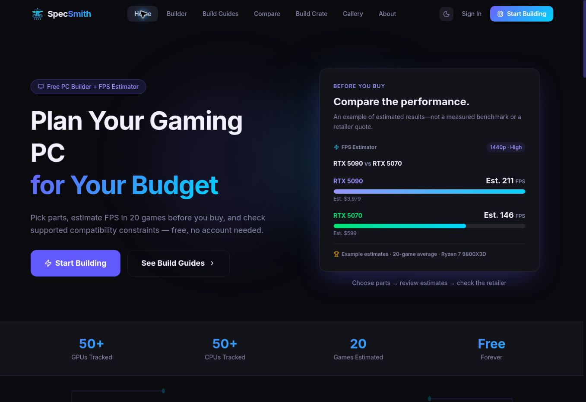
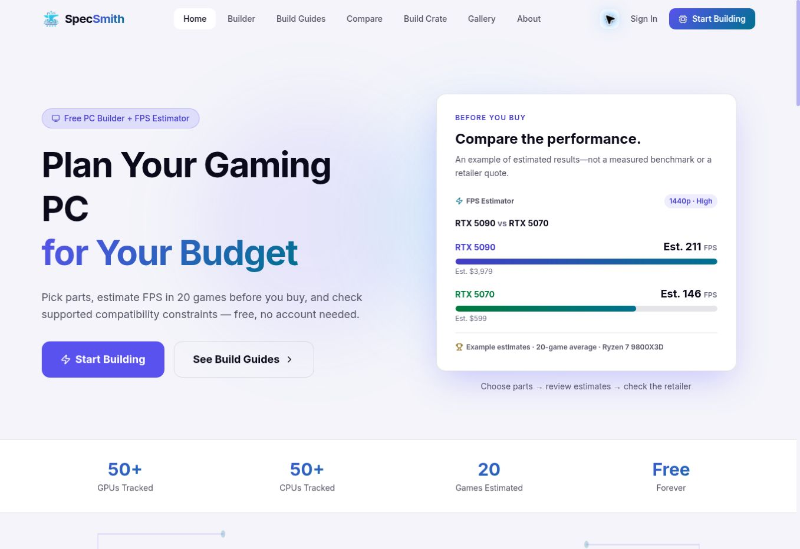
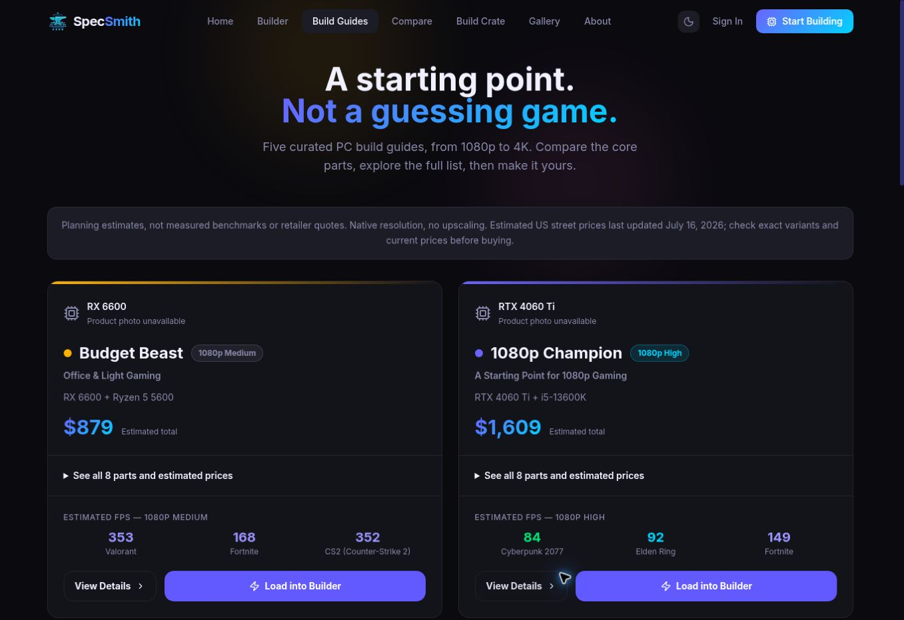
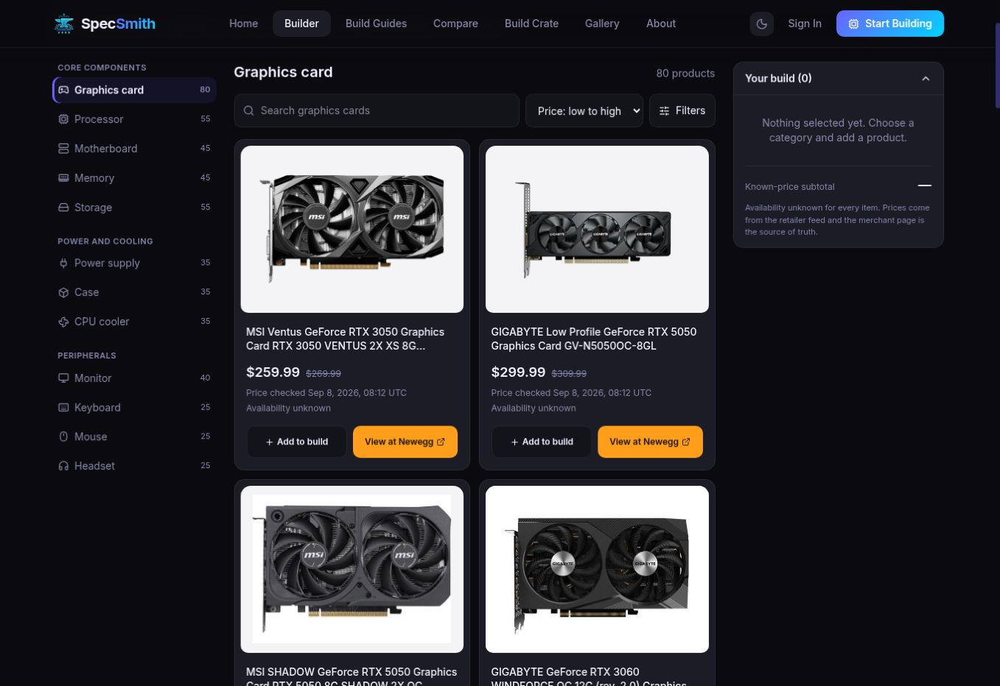
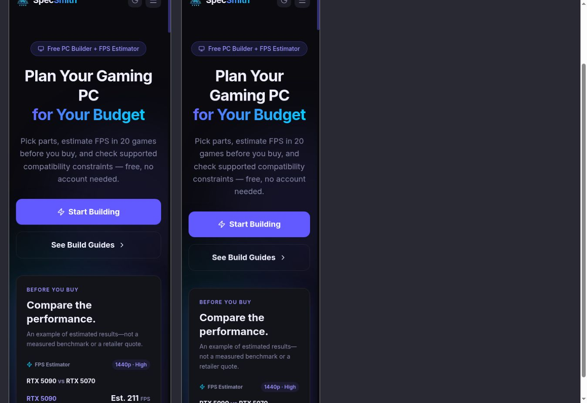
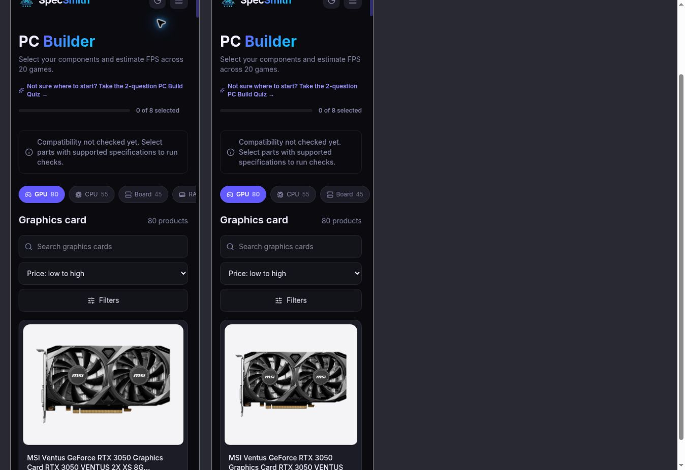

# Visual review — first batch

Implements #106 for founder review, not deployment. Homepage, Build Guides overview and retailer-card presentation only. The remaining site pages and Claude's FPS/cart/loading changes are not included.

## Changes

- Shorter homepage hero, larger stationary estimate example, wrapping build-guide grid and readable FAQ copy.
- Compact two-column guide overview with native keyboard-operable part disclosures, preserved detail URLs and build query parameters.
- Guide photography requires an existing verified GPU model mapping and explicitly labels the depicted retailer variant. None of the five guide GPUs exist in the checked catalogue, so no unrelated image is shown. Prices remain separate canonical estimates.
- Original retailer photographs remain untouched in a consistent light inset frame in both themes. This does not remove baked-in white or black pixels.
- Retailer button uses orange/near-black fill pairing independently of theme-specific text colors. Cards retain existing mobile height and image-zoom limits.
- Root development command permits previewing the existing pnpm workspace without copying or changing dependency policy.

## Verification

- TypeScript: passed.
- Focused tests: 34/34, including the original 30 retailer builder tests and four visual-refresh behavior tests.
- Full suite: 2034 passed, 17 failed (2051 total). Failures are in scripts/measured/cancellation.test.ts; output includes EPERM creating tsx local pipes and pnpm refusing ignored esbuild build scripts. No tests or dependency policy weakened. Not a clean full-suite result; independent CI remains required.
- Production Vite build and prerender: passed, 374 sitemap URLs.
- Desktop homepage checked in both themes; guide overview and native disclosure checked; retailer cards inspected with original catalogue photographs.
- Mobile evidence uses real app documents inside 375px and 320px development-only iframes, not a physical-device emulation. Homepage and builder captured; complete mobile/light-theme matrix remains a review gate. A small 4px homepage scroll-width discrepancy was observed at the narrow frame and is not certified as resolved.
- Preview dev mode logged a hydration mismatch at the existing Navbar boundary; production hydration has not been certified by this pass.

## Screenshots

## Release gates

This is a draft visual review, not a finished site-wide overhaul. Aaron reviews the design first; independent technical review and remaining viewport/production checks must pass before merge. Main advanced only through a catalogue refresh while this branch was prepared; integrate and verify the latest catalogue before release. Rollback is a normal revert of this UI change; no data or schema migration.
